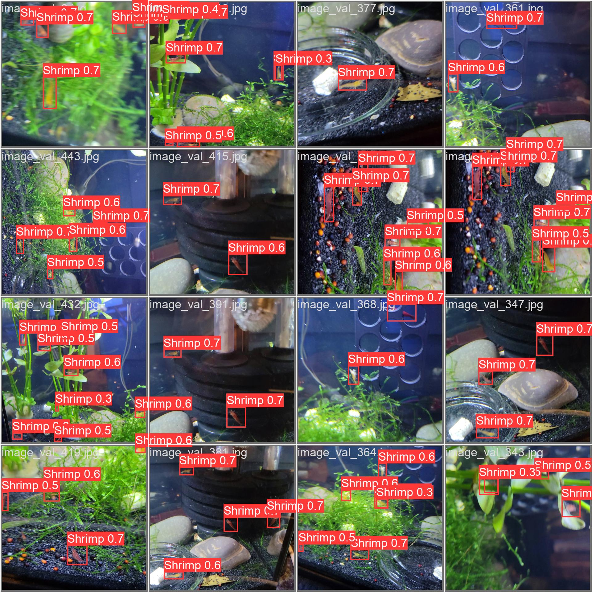
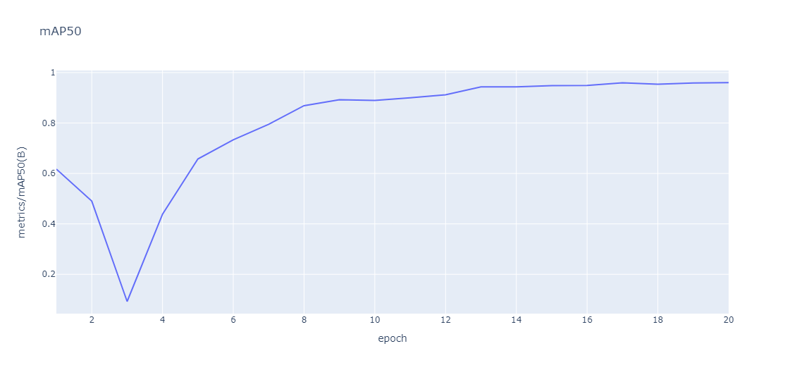

# Aquarium Shrimp Counting System

## Overview

This project utilizes computer vision and artificial intelligence to automate the counting of shrimp in an aquarium using a Jetson Nano. The system captures images from a camera placed infront of the aquarium, processes them using deep learning models, and provides the count for automation purposes.

## Table of Contents

- [Installation](#installation)
- [Usage](#usage)
- [Hardware Requirements](#hardware-requirements)
- [Software Requirements](#software-requirements)
- [Code Structure](#code-structure)
- [Configuration](#configuration)
- [Integration with Aquarium Automation](#integration-with-aquarium-automation)
- [Demo](#demo)
- [Train](#train)
- [License](#license)



## Installation

```bash
# Clone the repository
git clone https://github.com/your-username/aquarium-shrimp-counting.git

# Navigate to the project directory
cd aquarium-shrimp-counting

# Install dependencies
pip install -r requirements.txt

# Install Pycuda
export PATH=/usr/local/cuda-10.2/bin${PATH:+:${PATH}}
export LD_LIBRARY_PATH=/usr/local/cuda-10.2/lib64:$LD_LIBRARY_PATH
python3 -m pip install pycuda --user

# Install Seaborn
sudo apt install python3-seaborn
```

## Usage

```bash
# Run the shrimp counting system
python app.py

# Run the arduino ino script on arduino UNO
```
[app.py](app.py)
[shrimp.ino](arduino/shrimp.ino)
## Hardware Requirements

- NVIDIA Jetson Nano 4GB
- Arduino UNO R1
- Logitech C270

## Software Requirements

- Ubuntu 20.04.6 [(Link)](https://github.com/Qengineering/Jetson-Nano-Ubuntu-20-image)
- Tensorrt [(Link)](https://github.com/wang-xinyu/tensorrtx)
- Python 3.8
- OpenCV
- YOLOv5

## Code Structure

Explain the organization of your codebase. Highlight key directories and files.

```
/BreadcrumbsAquarium-Shrimp-Counting-System-YOLO
    ├── model.pt
    ├── arduino
    │   ├── shrimp.ino
    ├── yolov5
    │   ├── images
    │   ├── build
    │   │   ├── model.engine
    │   │   └── ...
    ├── app.py
    ├── README.md
    ├── requirements.txt
    └── ...
```

## Configuration

```yaml
serial:
  port: /dev/ttyUSB0

engine:
  path: yolov5/build/model.engine

WIDTH:
  resolution: 600x600

model:
  type: YOLOv5
```

## Integration with Aquarium Automation

### Arduino serial loop : 
```ino
void loop() {
  if(Serial.available()){
    receceivedBytes = Serial.read();
    receceivedChar = receceivedBytes - '0';
  } 
  for (int i = 0; i < numSegments; i++) {
    digitalWrite(segmentPins[i], bitRead(seg[receceivedChar][0], i));
  }
}
```
To use this system for automation with an Arduino UNO, simply take the input value from the serial communication and use it, for example, to feed the shrimp accordingly and monitor the population's evolution over time.

## Demo

[Watch Demo](link-to-demo-video)

## Train

To train your own model, you can follow the example from the YOLOv5 or YOLOv8 notebook and then use TensorRT to convert the .pt model to .engine, making it ready for use. [(Link)](https://github.com/wang-xinyu/tensorrtx)



```

# Generate .wts file from .pt
python gen_wts.py -w model.pt -o model.wts

# Generate .engine file from .wts
./yolov5_det -s model.wts model.engine s

```

## License

This project is licensed under the [MIT License](LICENSE).

---
